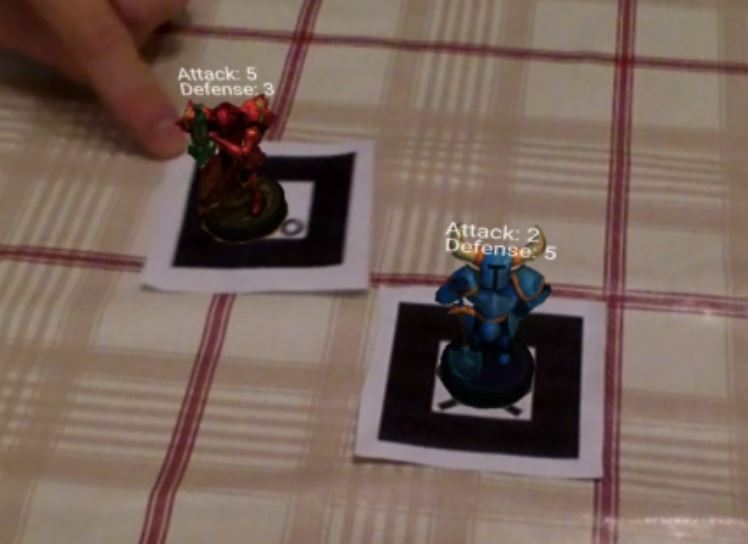

# Dejarik

## **What is Dejarik?**
---

Dejarik is a prototype for a chess-style game played using augmented reality. Players will place their game pieces - taking the form of markers - on the board, and after viewing the board through an augmented reality display will be able to see the models representing such pieces (see screenshot above). The two game pieces contained in the sample code run on the "hiro" marker preset and the "kanji" marker preset, both of which can be found in the AR.js documentation (linked in the sources section below).

[Dejarik is named after the holographic chess game played by characters in the Star Wars franchise.](https://www.youtube.com/watch?v=rN0T5tyJlo8)

### **Game Rules**
---

Each piece has an attack and defense value. If a piece looks at another piece, a battle will begin, which will have the following outcome:
* If the attacker's attack is GREATER OR EQUAL TO the opponent's defense, the attacker will win and the enemy piece will shrink and be erased off the board.
* If the attacker does not win a new check is made - if the opponent's attack is GREATER OR EQUAL TO the attacker's defense, then the attacker will lose and be erased off the board.

The attacker gets a slight surprise attack advantage because it gets to use its attack value first - so for example, even if its defense is weaker than the opponent's attack, if it goes first and its attack is greater than the opponent's defense, it will still win.  

### **Video Demo**
---
A video demo will be added to this GitHub repository once it is made public.

## **What technologies were used in the making of Dejarik?**

### **Photogrammetry**
---

To scan in the models, the [Metashape](https://www.agisoft.com/) tool was used. I initially considered using Meshroom - however, to make the most of it, an NVIDIA graphics card needed to be used (because it ran on the proprietary CUDA graphics-acceleration toolkit). I have an AMD Radeon, so for this reason I opted for Metashape, which uses OpenCL instead, which is open source and can run on my graphics card.

The resulting models were of a reasonably high quality, but included a large portion of the table on which I scanned them, as well as some other deformities. For this reason, I touched them up a little in Blender and used the Decimate modifier to reduce the polygon count, just to make sure that they could be loaded up quickly through a web page.

I ultimately decided on using the glTF format for the models, as it seem to be optimised for use with web pages.  

### **Augmented Reality**
---

For the augmented reality portion of this project, the [AR.js](https://ar-js-org.github.io/AR.js-Docs/) framework was used, which in turn relies on A-Frame and three.js.

The game logic is contained in the main.js file, which includes A-Frame components responsible for toggling the UI and for the collision checks between entities. 

Game pieces are added in the main HTML file through the use of \<a-marker> tags, which specify what marker is bound to a given object, but also all the various descriptive elements relating to that marker, for example, the model, the game stats, whether or not the piece is "dead", etc.

The components are designed to be modular, meaning that new pieces can be added with relative ease, with the only tweaks needing to be made relating to the individual properties of a given piece like what model needs to be used for it. 

## **Future Work**
---

Ideally, more marker shapes and models will be introduced, so that more game pieces could be added to the game. Also, it would be interesting to add some modifications to the rules - for example, certain game pieces should be able to pierce several pieces at once, or maybe attack not just from the front but from the back and sides, too.

## **Sources and References**
---

The documentation written for AR.js, A-Frame, and Metashape was invaluable for the production of this project. I have set out below the main links to documentation and tutorials used over the course of Dejarik's production:

* https://aframe.io/docs/1.3.0/introduction/writing-a-component.html
* https://aframe.io/docs/1.3.0/components/raycaster.html
* https://agisoft.freshdesk.com/support/solutions/articles/31000152092
* https://ar-js-org.github.io/AR.js-Docs/
* https://medium.com/swlh/how-to-handle-click-events-on-ar-js-f397ea5994d

**END**